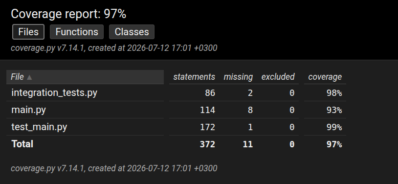

# Testing Documentation

## Unit Testing

Unit tests were created, using Python's unittest library, to verify that each component functions correctly and handles both valid and invalid inputs. The purpose of the unit tests is to ensure that normal cases, edge cases and possible errors are addressed before testing how well they are integrated. 



A coverage report is generated after running the unit and integration tests. The report illustrates how much of each function is executed by the test suite. The report shows that functions read_articles(), markov_model() and text_generation() have some sections that are not fully covered as they stand at 89%, 88% and 96% respectively. In the case of read_articles(), the lower percentage may be attributed to the fact that the cp1252 fallback line is likely less frequented than its UTF-8 counterpart. 

### Test Reproducibility

The tests can be reproduced by running the project's automated test suite. All test cases and sample inputs are included in the repository. 

### Unit Test Cases

#### `read_articles()`
- Verify expected output is returned
- Verify single-file processing
- Verify multiple-file processing
- Verify `NaN` values are removed
- Verify valid column names are accepted
- Verify output is a string
- Verify invalid column names are rejected

#### `clean_articles()`
- Verify text is converted to lowercase
- Verify HTML tags are removed
- Verify URLs are removed
- Verify invalid characters are removed
- Verify numbers are retained
- Verify excess whitespace is removed
- Verify empty strings or punctuation-only input return an empty result

#### `Node` Class
- Verify object creation
- Verify nodes have no children at the start
- Verify `Node.children` is a dictionary

#### `TrieTree` Class
- Verify successors are retrieved correctly
- Verify single successor returned
- Verify multiple successors returned  
- Verify duplicate successors are not returned
- Verify an empty list is returned when no successors exist
- Verify duplicate sequences are counted correctly 
- Verify that __str__() preserves prefix sequences 
- Verify that __str__() limits output to ten sequences 

#### `markov_model()`
- Verify a `TrieTree` is returned
- Verify word counts are calculated correctly

#### `text_generation()`
- Verify output is a string
- Verify output is not empty
- Verify the correct number of sentences is generated
- Verify sentence length

## Integration Testing

Integration tests were performed to verify that components interact as expected. As such, the tests evaluated how data flows between smaller sections of the code(i.e read_articles() to clean_articles()) to ensure they work correctly when combined. In addition, the pipeline in its entirety is evaluated to confirm an appropriate output is returned. 

#### `read_articles()` → `clean_articles()`
- Verify tokenised output is produced
- Verify punctuation is removed
- Verify only the selected column is processed

#### `read_articles()` → `markov_model()`
- Verify a `TrieTree` is created
- Verify correct successors are stored
- Verify generated text contains cleaned vocabulary

#### End-to-End Pipeline
- Verify the pipeline returns a non-empty string
- Verify the correct number of sentences is generated
- Verify generated text contains only words from the original vocabulary 
- Verify generated words originate from the source CSV
- Verify results are reproducible when using the same inputs and random seed

## Running Tests (All commands must be run from the src directory)


### Unit tests
```
poetry run coverage run -m unittest test_main.py
```
 
### Integration tests
```
poetry run coverage run -a -m unittest integration_tests.py
```

### Generate a test coverage report with:
```
poetry run coverage report
```
