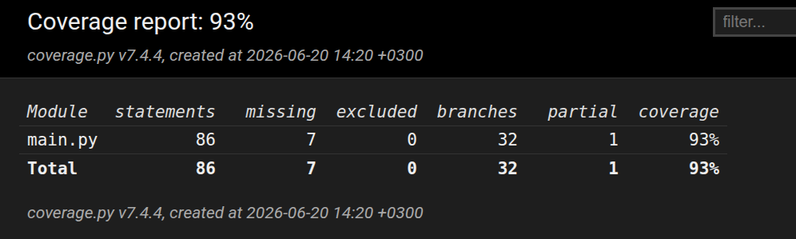

# Testing Documentation

## Unit Testing

Unit tests were created, using the unittest library, to verify that each component functions correctly and handles both valid and invalid inputs.

### Test Reproducibility

The tests can be reproduced by running the project's automated test suite. All test cases and sample inputs are included in the repository. 

### Unit Test Cases

#### `read_articles()`
- Verify expected output is returned
- Verify single-file processing
- Verify multiple-file processing
- Verify `NaN` values are removed
- Verify valid column names are accepted
- Verify output is a string
- Verify invalid column names are rejected

#### `clean_articles()`
- Verify text is converted to lowercase
- Verify HTML tags are removed
- Verify URLs are removed
- Verify invalid characters are removed
- Verify output is a list
- Verify numbers are retained
- Verify excess whitespace is removed
- Verify empty strings or punctuation-only input return an empty result

#### `Node` Class
- Verify object creation
- Verify nodes have no children at the start
- Verify `nodechildren` is a dictionary

#### `TrieTree` Class
- Verify successors are retrieved correctly
- Verify all possible successors are returned
- Verify duplicate successors are not returned
- Verify an empty list is returned when no successors exist

#### `markov_model()`
- Verify a `TrieTree` is returned
- Verify word counts are calculated correctly

#### `text_generation()`
- Verify output is a string
- Verify output is not empty
- Verify the correct number of sentences is generated
- Verify sentence length

## Integration Testing

Integration tests were performed to verify that components work correctly together.

### `read_articles()` → `clean_articles()`
- Verify tokenized output is produced
- Verify punctuation is removed
- Verify only the selected column is processed

### `read_articles()` → `markov_model()`
- Verify a `TrieTree` is created
- Verify correct successors are stored
- Verify all expected words exist in the trie

### `markov_model()` → `text_generation()`
- Verify output is a non-empty string
- Verify the correct number of sentences is generated
- Verify generated text contains valid tokens

### End-to-End Pipeline
- Verify the pipeline returns a non-empty string
- Verify generated words originate from the source csv
- Verify results are reproducible when using the same inputs and random seed
